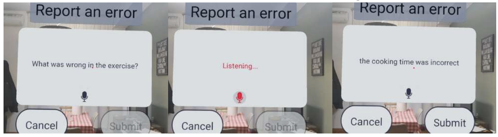
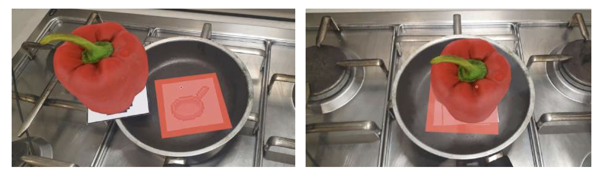
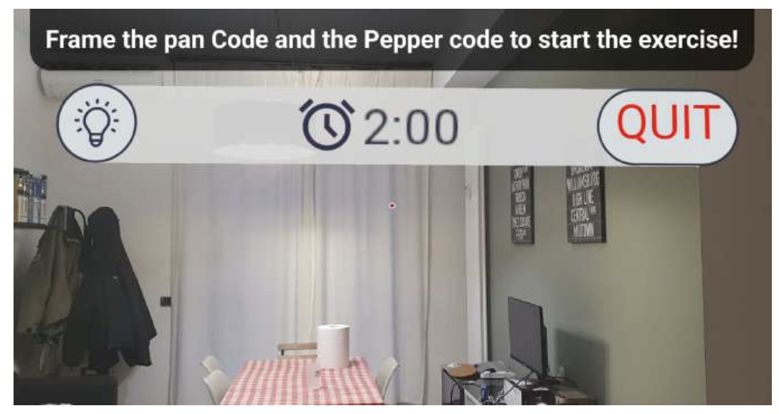

# BlitzCook 🍳
> **Value Proposition:** Learn from your mistakes!

BlitzCook is an innovative **Augmented Reality (AR)** application designed for beginner amateur cooks. Developed as part of the Human-Computer Interaction course at **Politecnico di Torino** (A.Y. 2025-2026).

## 📖 Project Overview
Beginner cooks are often overwhelmed by new recipes, leading to ingredient waste due to trial and error. BlitzCook solves this through "Shock Therapy": placing the user in critical kitchen situations that must be managed in real-time.

The application uses **AI** to generate custom exercises based on specific problems the user wants to avoid, ensuring a tailored learning experience.

## ✨ Key Features
* **AR Simulation:** Interact with virtual ingredients and tools rendered over physical printable codes.
* **Hands-Free Interaction:** Uses **Gaze Input** (point-and-stare) and **Vocal Input** so users can keep their hands free for cooking.
* **Real-Time Feedback:** Virtual models smoke when cooking and change color when done.
* **Shopping List:** Select ingredients from exercises and add them to a shopping list to prepare for real-world cooking.
* **AI Error Reporting:** Users can report inaccuracies in exercises via voice to improve future AI generations.

## 🛠️ Technology Stack
* **Framework:** React Native
* **AR Library:** Viro (supporting 3D models, image tracking, and particles)
* **Database:** SQLite3 for data persistence
* **Voice Input:** React Native Voice
* **Design:** Prototyped in Figma

## 🚀 Getting Started
1. **Prepare the Markers:** Download and print the custom ingredient/tool codes (found in the `assets` folder).
2. **Launch the App:** Open BlitzCook on an AR-compatible device.
3. **Start Training:** Use the search bar (vocal input) or select a "Daily Exercise".
4. **Scan & Cook:** Frame the "Pan" and "Ingredient" codes to trigger the 3D models and start the timer.

## 🧪 Usability & Results
The High-Fidelity prototype was validated through rigorous usability testing, achieving an excellent **Average SUS Score of 93.33**. Users found the AR controls intuitive and effectively learned to manage kitchen crises without wasting real food.

## 👥 Group STRFLS
* De Dominicis Francesco Pio
* Pantani Pietro
* Tornesello Gianluca

---
*Developed for the Human-Computer Interaction Project - 2026*.
